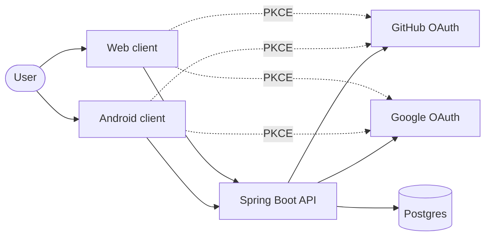

# Architecture

## Context (C4 level 1)

```mermaid
flowchart LR
  user([User]) --> web[Web client] & android[Android client]
  web & android --> api[Spring Boot API]
  web & android -. PKCE .-> gh[GitHub OAuth] & gg[Google OAuth]
  api --> gh & gg
  api --> db[(Postgres)]
```

## Containers (C4 level 2)
<!-- TODO Sprint 1 -->
